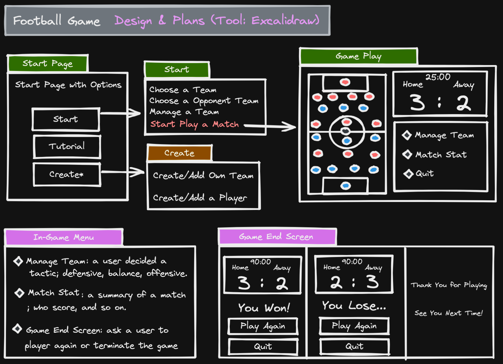
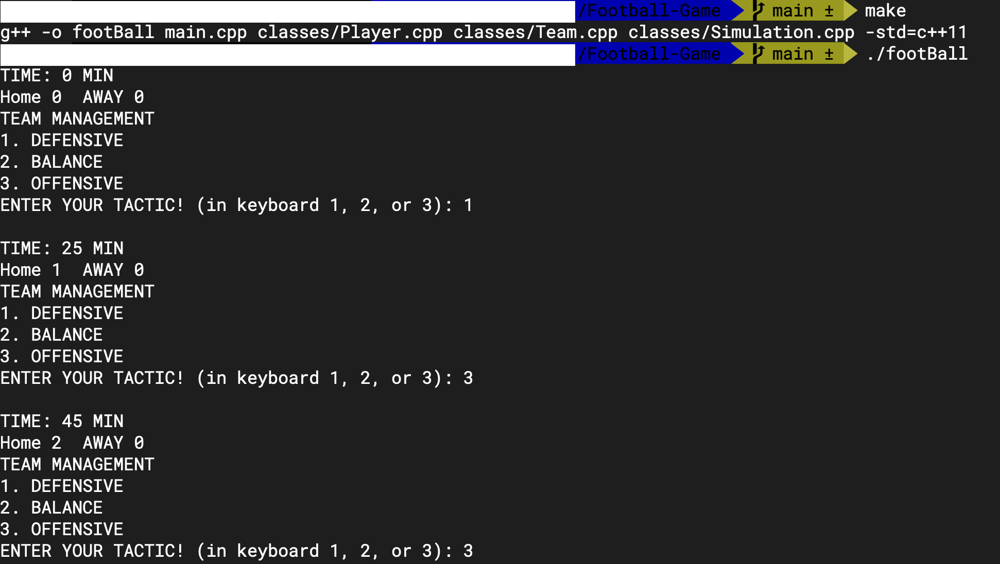
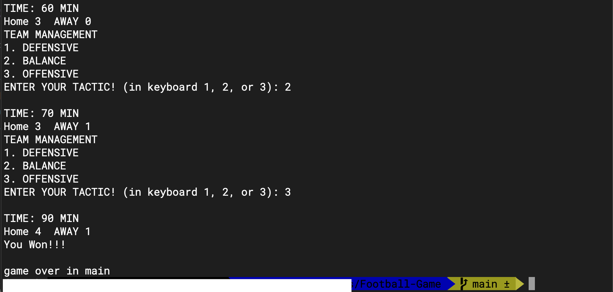

# Football-Game

This is turn-based strategy football game that a user manage tactics (defensive, balance, offensive) to win a football match

<h2>Implementations</h2>
<li>C++ OOP: </li>
<li>Classes: Player, Team, Simulation (match)</li>
<li>Manages players using a linked list data structure</li>
<li>raylib GUI tool (planning/future)</li>

<h2>Game Design & Plans (used tool: Excalidraw)</h2>

<ul>
<li>5 time lines; 25:00, 45:00, 60:00, 70:00 and 85:00</li>
<li>Each time line, an updated score will be displayed</li>
<li>A user can decide one’s tactic by clicking/typing “Manage Team” button</li>
</ul>

<h2>Console Demo (August 19, 2022)</h2>
<h4>How to Start</h4>
In terminal, where the project directory, run the following command
<pre><code>./footBall</code></pre>
If not working, then
<pre><code>make</code></pre>
<pre><code>./footBall</code></pre>

<h4>Screen Shot </h4>

Currently, only “Play” option is available and only a user can manage team; opponent is set to default formation (4-3-3) through out the game rounds.

<h2>Game Logic</h2>
<ul>
<li>A team is given a 100 percentage which is a probability that is distributed to 3 sectors; defence, midfield, offence</li>
<li>If a user’s command is [DEFENSIVE], then the probability of defence is increase so lower probability of getting a score from opponent</li>
<li>If a user’s command is [BALANCE], then the probability of defence and offence are increase at a moderate level
</li>
<li>If a user’s command is [OFFENSIVE], then the probability of offence is increase so higher probability of getting a score to opponent</li>
<li>Example: if a user choose a [OFFENSIVE] the probability of scoring a goal is increase, but also the probability of defence reduces</li>
</ul>

<h2>Additional Features Will be Implemented:</h2>
<ul>
<li>A user can create one’s own team</li>
<li>A user can create/edit a player</li>
</ul>

<h2>TODO:</h2>
<ol>
<li>Game Logic (Competition) - done</li>
<li>Input - done</li>
<li>Easy Version - done</li>
<li>Opponent Corresponding</li>
<li>Demo Version</li>
<li>Other Features (Create/edit/delete Players, Teams)</li>
<li>GUI</li>
</ol>

  
updated: August 27, 2022
