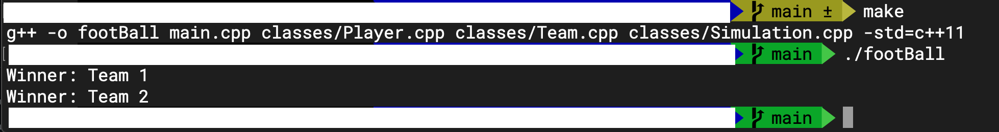

# Football-Game

This is turn-based strategy football game that a user manage tactics (defensive, balance, offensive) to win a football match

<h2>Implementations</h2>
<li>C++ OOP: </li>
<li>Classes: Player, Team, Simulation (match)</li>
<li>raylib GUI tool (planning)</li>

<h2>Game Design & Plans (used tool: Excalidraw)</h2>

<li>the game screen will be prompted with 5 time lines; 25:00, 45:00, 60:00, 70:00 and 85:00</li>
<li>each time line, an updated score will be displayed</li>
<li>a user can decide one’s tactic by clicking “Manage Team” button</li>

<h2>Game Logic (Currently implementing…)</h2>
<li>temp</li>

<h2>Additional Features:</h2>
<ul>
<li>A user can create one’s own team</li>
</ul>

<h2>Console Demo (August 19, 2022)</h2>
<h4>How to Start</h4>
In terminal, where the project directory, run the following command
<pre><code>./footBall</code></pre>
If not working, then
<pre><code>make</code></pre>
<pre><code>./footBall</code></pre>

<h4>Screen Shot </h4>

Players and teams are pre-defined in the main.cpp.
Expected features are not yet implemented.
Current version only simulate pre-defined teams and simulate by itself.

  
updated: August 19, 2022
